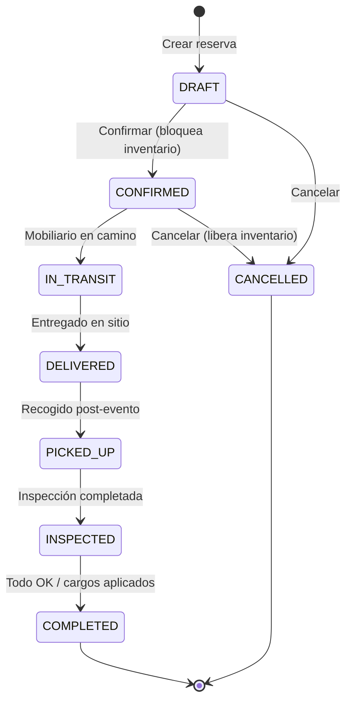
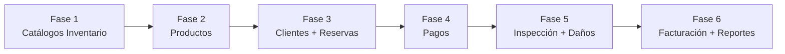

# Sistema de Inventario y Facturación para Alquiler de Mobiliario

Sistema backend para un pequeño comercio de alquiler de sillas, mesas, canopys, inflables y equipamiento para eventos, con gestión de reservas por fechas/horarios y generación de facturas.

## Resumen de la Arquitectura Existente

La plantilla ya provee una base sólida con:

| Capa | Tecnología | Patrón |
|------|-----------|--------|
| Framework | NestJS 11 | Módulos, Guards globales, Interceptors |
| Persistencia | Prisma 7 + PostgreSQL | Adapter PG, transacciones via `AsyncLocalStorage` |
| Autenticación | JWT + Passport | Guard global `JwtPassportAuthGuard` |
| Autorización | Permisos por ruta | Guard global `PermissionsGuard` |
| Arquitectura | Hexagonal + CQRS | `CommandBus` / `QueryBus` de `@nestjs/cqrs` |
| Colas | BullMQ + Redis | Workers separados, Bull Board UI |
| Caché | Redis (Keyv) | `CatalogCacheService` |
| Observabilidad | Pino + Prometheus | Métricas, logs estructurados |
| Auditoría | `mnt_audit_log` | Interceptor `@Auditable()` |
| Rate Limiting | Throttler | Global + por ruta |
| Storage | S3 | Módulo de archivos |

**Convención de módulos detectada:**
```
src/modules/<nombre>/
├── application/
│   ├── commands/<entidad>/create-<entidad>/  → command.ts + handler.ts
│   ├── queries/<entidad>/get-<entidad>/      → query.ts + handler.ts
│   ├── dtos/                                  → Application DTOs
│   ├── repositories/                          → Abstract read repos (queries)
│   ├── ports/                                 → Interfaces de puertos
│   └── services/                              → Application services
├── domain/
│   ├── entities/                               → Entidades de dominio
│   ├── repositories/                          → Abstract write repos (commands)
│   └── value-objects/                         → Value Objects con validación
├── infrastructure/
│   ├── config/                                → repositories.config, commands-handlers.config, etc.
│   ├── controllers/                           → REST controllers
│   ├── dtos/
│   │   ├── validators/                        → DTOs con class-validator (input)
│   │   ├── http/                              → DTOs de respuesta HTTP
│   │   └── query/                             → DTOs de query params
│   ├── implementation/                        → Implementación concreta de repos
│   ├── guards/, decorators/, strategies/
│   └── processors/                            → BullMQ processors
└── <nombre>.module.ts
```

---

## Decisiones de Diseño (basadas en tus respuestas)

| Decisión | Resolución |
|----------|------------|
| Fechas/horarios | `DateTime` con hora inicio/fin + campo `transit_time_minutes` para traslado |
| Moneda | USD por defecto, tabla `ctl_currency` abstracta para futuras divisas |
| Paquetes/Combos | No se implementan ahora; el schema permite añadirlo sin romper nada |
| Pagos | Solo cash por ahora; se crea `PaymentGatewayPort` abstracto para pasarelas futuras |
| Daño/pérdida | Modelo `mnt_reservation_inspection` con líneas de daño y cargos adicionales |
| Clientes | **Entidad separada `mnt_customer`**, no se reutiliza `mnt_people` (ver justificación abajo) |

### ¿Por qué `mnt_customer` separado de `mnt_people`?

`mnt_people` pertenece al bounded context de **IAM/Auth** — son usuarios del sistema con relaciones a `mnt_user`, `ctl_gender`, `ctl_marital_status`, `mnt_document`, `people_country`, etc. Un cliente de alquiler:
- No necesita gender, marital status, ni el sistema de documentos
- Sí necesita: `company_name`, `tax_id` (EIN), dirección de entrega, teléfono secundario
- Si a futuro se crea un portal self-service para clientes, se vincula `mnt_customer.id_user` → `mnt_user` opcionalmente

---

## Proposed Changes

El desarrollo se divide en **6 fases incrementales**, cada una desplegable de forma independiente.

---

### Fase 1: Catálogos Base del Inventario

Fundamento de datos: categorías de productos, condiciones y moneda.

#### [NEW] Prisma Schema — Nuevos modelos de catálogo

Se agregan al final de [schema.prisma](file:///c:/Users/angel/Desktop/facturacion_electronica_back_end/prisma/schema.prisma):

```prisma
// ──────────────────────────────────────────────
// CATÁLOGOS DEL SISTEMA DE INVENTARIO
// ──────────────────────────────────────────────

model ctl_product_category {
  id          String    @id @default(uuid()) @db.Uuid
  name        String    @unique @db.VarChar(150)
  description String?   @db.VarChar(255)
  icon        String?   @db.VarChar(100)  // ej: "chair", "table", "tent"
  active      Boolean   @default(true)
  created_at  DateTime? @db.Timestamp(0)
  updated_at  DateTime? @db.Timestamp(0)
  deleted_at  DateTime? @db.Timestamp(0)

  mnt_product mnt_product[]
}

model ctl_product_condition {
  id          String    @id @default(uuid()) @db.Uuid
  name        String    @unique @db.VarChar(100)
  description String?   @db.VarChar(255)
  active      Boolean   @default(true)
  created_at  DateTime? @db.Timestamp(0)
  updated_at  DateTime? @db.Timestamp(0)
  deleted_at  DateTime? @db.Timestamp(0)
}

model ctl_currency {
  id          String    @id @default(uuid()) @db.Uuid
  name        String    @unique @db.VarChar(100) // "US Dollar"
  code        String    @unique @db.VarChar(3)   // "USD"
  symbol      String    @db.VarChar(5)           // "$"
  is_default  Boolean   @default(false)
  active      Boolean   @default(true)
  created_at  DateTime? @db.Timestamp(0)
  updated_at  DateTime? @db.Timestamp(0)
  deleted_at  DateTime? @db.Timestamp(0)

  mnt_reservation mnt_reservation[]
  mnt_invoice     mnt_invoice[]
}
```

#### [NEW] Módulo `src/modules/inventory/`

Estructura siguiendo la convención existente:

```
src/modules/inventory/
├── inventory.module.ts
├── application/
│   ├── dtos/
│   │   └── product-category.dto.ts
│   ├── repositories/
│   │   └── product-category-read.repository.ts
│   ├── product-category/
│   │   ├── commands/
│   │   │   ├── create-product-category/  → command.ts + handler.ts
│   │   │   ├── update-product-category/  → command.ts + handler.ts
│   │   │   └── delete-product-category/  → command.ts + handler.ts
│   │   └── queries/
│   │       ├── get-product-categories/   → query.ts + handler.ts
│   │       └── get-product-category/     → query.ts + handler.ts
├── domain/
│   ├── entities/
│   │   └── product-category.ts
│   ├── repositories/
│   │   └── product-category-repository.ts
│   └── value-objects/
│       └── product-category-value-object/
│           ├── product-category-id.ts
│           ├── product-category-name.ts
│           └── product-category-description.ts
├── infrastructure/
│   ├── config/
│   │   ├── repositories.config.ts
│   │   ├── commands-handlers.config.ts
│   │   └── queries-handlers.config.ts
│   ├── controllers/
│   │   └── product-category.controller.ts
│   ├── dtos/
│   │   ├── validators/
│   │   │   └── product-category/
│   │   │       ├── create-product-category.dto.ts
│   │   │       └── update-product-category.dto.ts
│   │   ├── http/
│   │   │   └── product-category-http.dto.ts
│   │   └── query/
│   │       └── get-product-categories-query.dto.ts
│   └── implementation/
│       └── product-category/
│           └── impl-product-category.repository.ts
```

#### [NEW] Seeds

| Archivo | Datos |
|---------|-------|
| `prisma/seeds/ctl-product-category.seeder.ts` | Chairs, Tables, Canopies/Tents, Inflatables, Linens/Decor, Lighting, Sound Equipment, Others |
| `prisma/seeds/ctl-product-condition.seeder.ts` | New, Good, Fair, Damaged, Under Repair |
| `prisma/seeds/ctl-currency.seeder.ts` | USD (default) |

#### [MODIFY] [app.module.ts](file:///c:/Users/angel/Desktop/facturacion_electronica_back_end/src/app.module.ts)

Importar `InventoryModule`.

#### [MODIFY] [core.seeder.ts](file:///c:/Users/angel/Desktop/facturacion_electronica_back_end/prisma/seeds/core.seeder.ts)

Agregar llamadas a los nuevos seeders.

#### [MODIFY] Permisos en [ctl-category-permissions.seeder.ts](file:///c:/Users/angel/Desktop/facturacion_electronica_back_end/prisma/seeds/ctl-category-permissions.seeder.ts) y [ctl-permissions.seeder.ts](file:///c:/Users/angel/Desktop/facturacion_electronica_back_end/prisma/seeds/ctl-permissions.seeder.ts)

Agregar categoría "Inventory" con permisos CRUD para product categories.

---

### Fase 2: Productos (Inventario de Artículos)

El corazón del sistema: cada artículo disponible para alquiler.

#### [NEW] Prisma Schema — Productos

```prisma
model mnt_product {
  id                  String    @id @default(uuid()) @db.Uuid
  name                String    @db.VarChar(200)
  description         String?   @db.VarChar(500)
  sku                 String    @unique @db.VarChar(50)
  rental_price        Decimal   @db.Decimal(10, 2)       // Precio por unidad por evento
  replacement_cost    Decimal?  @db.Decimal(10, 2)       // Costo de reposición si se daña/pierde
  total_stock         Int                                 // Cantidad total en inventario
  min_stock_alert     Int       @default(0)              // Alerta de stock mínimo
  color               String?   @db.VarChar(50)
  dimensions          String?   @db.VarChar(100)         // "6ft x 2.5ft"
  weight_lbs          Decimal?  @db.Decimal(8, 2)
  image_url           String?   @db.VarChar(500)
  notes               String?   @db.Text
  active              Boolean   @default(true)
  created_at          DateTime? @db.Timestamp(0)
  updated_at          DateTime? @db.Timestamp(0)
  deleted_at          DateTime? @db.Timestamp(0)

  id_category         String    @db.Uuid
  ctl_product_category ctl_product_category @relation(fields: [id_category], references: [id])

  mnt_reservation_item    mnt_reservation_item[]
  mnt_product_maintenance mnt_product_maintenance[]

  @@index([id_category])
  @@index([sku])
  @@index([active])
}

// Registro de mantenimiento/reparaciones — resta del stock disponible
model mnt_product_maintenance {
  id           String    @id @default(uuid()) @db.Uuid
  description  String    @db.VarChar(500)
  cost         Decimal?  @db.Decimal(10, 2)
  quantity     Int       @default(1)          // Cuántas unidades en mantenimiento
  date_start   DateTime  @db.Date
  date_end     DateTime? @db.Date
  resolved     Boolean   @default(false)
  created_at   DateTime? @db.Timestamp(0)
  updated_at   DateTime? @db.Timestamp(0)

  id_product   String    @db.Uuid
  mnt_product  mnt_product @relation(fields: [id_product], references: [id])

  @@index([id_product])
  @@index([resolved])
  @@index([id_product, resolved])
}
```

#### [NEW] Sub-módulo en `src/modules/inventory/` — Products

Se agrega dentro del mismo `InventoryModule`:

```
src/modules/inventory/
├── application/
│   ├── dtos/
│   │   ├── product-category.dto.ts        (ya existente de Fase 1)
│   │   └── product.dto.ts                 ← NUEVO
│   ├── repositories/
│   │   ├── product-category-read.repository.ts  (Fase 1)
│   │   └── product-read.repository.ts           ← NUEVO
│   ├── product/
│   │   ├── commands/
│   │   │   ├── create-product/            → command.ts + handler.ts
│   │   │   ├── update-product/            → command.ts + handler.ts
│   │   │   ├── toggle-product-status/     → command.ts + handler.ts
│   │   │   └── register-maintenance/      → command.ts + handler.ts
│   │   └── queries/
│   │       ├── get-products/              → query.ts + handler.ts (filtros: categoría, activo, rango precio)
│   │       ├── get-product/               → query.ts + handler.ts
│   │       └── check-availability/        → query.ts + handler.ts (producto + rango fechas → qty disponible)
│   └── services/
│       └── availability.service.ts        → Calcula: total_stock - reservadas_en_rango - en_mantenimiento
├── domain/
│   ├── entities/
│   │   └── product.ts
│   ├── repositories/
│   │   └── product-repository.ts
│   └── value-objects/
│       └── product-value-object/
│           ├── product-id.ts
│           ├── sku.ts
│           ├── rental-price.ts
│           └── stock-quantity.ts
├── infrastructure/
│   ├── controllers/
│   │   ├── product-category.controller.ts  (Fase 1)
│   │   └── product.controller.ts           ← NUEVO
│   ├── dtos/
│   │   ├── validators/product/
│   │   │   ├── create-product.dto.ts
│   │   │   └── update-product.dto.ts
│   │   ├── http/product-http.dto.ts
│   │   └── query/get-products-query.dto.ts
│   └── implementation/
│       └── product/
│           └── impl-product.repository.ts
```

**`AvailabilityService`** — Lógica core:
```
disponible(producto, fecha_inicio, fecha_fin) = 
    producto.total_stock 
  - SUM(items reservados con evento que se traslape con [fecha_inicio, fecha_fin] y status ∉ [CANCELLED, COMPLETED])
  - SUM(mantenimiento no resuelto cuyo rango se traslape)
```

---

### Fase 3: Clientes y Reservas

El flujo principal del negocio.

#### [NEW] Prisma Schema — Clientes

```prisma
model mnt_customer {
  id              String    @id @default(uuid()) @db.Uuid
  first_name      String    @db.VarChar(150)
  last_name       String    @db.VarChar(150)
  email           String?   @db.VarChar(150)
  phone           String    @db.VarChar(20)
  phone_secondary String?   @db.VarChar(20)
  company_name    String?   @db.VarChar(200)
  tax_id          String?   @db.VarChar(50)       // EIN / Tax ID para US
  address_line1   String?   @db.VarChar(255)
  address_line2   String?   @db.VarChar(255)
  city            String?   @db.VarChar(100)
  state           String?   @db.VarChar(100)
  zip_code        String?   @db.VarChar(20)
  notes           String?   @db.Text
  active          Boolean   @default(true)
  created_at      DateTime? @db.Timestamp(0)
  updated_at      DateTime? @db.Timestamp(0)
  deleted_at      DateTime? @db.Timestamp(0)
  id_user         String?   @unique @db.Uuid      // FK opcional a mnt_user (futuro portal self-service)

  mnt_reservation mnt_reservation[]
  mnt_invoice     mnt_invoice[]

  @@index([phone])
  @@index([email])
  @@index([last_name])
  @@index([active])
}
```

#### [NEW] Prisma Schema — Reservas (con horarios + tiempo de traslado)

```prisma
model mnt_reservation {
  id                    String    @id @default(uuid()) @db.Uuid
  reservation_number    String    @unique @db.VarChar(20)  // RES-2026-0001

  // ── Fechas y horarios del evento ──
  event_start           DateTime  @db.Timestamptz(0)       // Inicio del evento (fecha + hora)
  event_end             DateTime  @db.Timestamptz(0)       // Fin del evento (fecha + hora)

  // ── Logística de entrega/recolección ──
  delivery_datetime     DateTime? @db.Timestamptz(0)       // Cuándo se entrega el mobiliario
  pickup_datetime       DateTime? @db.Timestamptz(0)       // Cuándo se recoge el mobiliario
  transit_time_minutes  Int       @default(0)              // Tiempo estimado de traslado (ida)
  delivery_address      String?   @db.VarChar(500)
  delivery_city         String?   @db.VarChar(100)
  delivery_state        String?   @db.VarChar(100)
  delivery_zip          String?   @db.VarChar(20)
  delivery_notes        String?   @db.Text
  delivery_contact_name String?   @db.VarChar(200)         // Persona que recibe en sitio
  delivery_contact_phone String?  @db.VarChar(20)

  // ── Datos del evento ──
  event_type            String?   @db.VarChar(100)         // "Wedding", "Birthday", "Corporate"
  venue_name            String?   @db.VarChar(200)         // Nombre del local/lugar

  // ── Montos ──
  subtotal              Decimal   @db.Decimal(10, 2)
  tax_rate              Decimal   @default(0) @db.Decimal(5, 4)  // Ej: 0.0825 para 8.25%
  tax_amount            Decimal   @default(0) @db.Decimal(10, 2)
  discount_amount       Decimal   @default(0) @db.Decimal(10, 2)
  discount_reason       String?   @db.VarChar(255)
  delivery_fee          Decimal   @default(0) @db.Decimal(10, 2)
  total                 Decimal   @db.Decimal(10, 2)
  deposit_amount        Decimal   @default(0) @db.Decimal(10, 2)
  balance_due           Decimal   @db.Decimal(10, 2)

  // ── Notas ──
  notes                 String?   @db.Text                 // Notas visibles en factura
  internal_notes        String?   @db.Text                 // Solo internas

  // ── Estado ──
  status                String    @db.VarChar(30)
  // DRAFT → CONFIRMED → IN_TRANSIT → DELIVERED → PICKED_UP → INSPECTED → COMPLETED
  // DRAFT → CANCELLED | CONFIRMED → CANCELLED

  // ── Auditoría ──
  created_at            DateTime? @db.Timestamp(0)
  updated_at            DateTime? @db.Timestamp(0)
  deleted_at            DateTime? @db.Timestamp(0)
  confirmed_at          DateTime? @db.Timestamp(0)
  cancelled_at          DateTime? @db.Timestamp(0)
  cancellation_reason   String?   @db.VarChar(500)

  // ── Relaciones ──
  id_customer           String    @db.Uuid
  id_currency           String    @db.Uuid
  id_created_by         String?   @db.Uuid

  mnt_customer           mnt_customer  @relation(fields: [id_customer], references: [id])
  ctl_currency           ctl_currency  @relation(fields: [id_currency], references: [id])

  mnt_reservation_item   mnt_reservation_item[]
  mnt_payment            mnt_payment[]
  mnt_reservation_inspection mnt_reservation_inspection[]

  @@index([id_customer])
  @@index([event_start])
  @@index([event_end])
  @@index([status])
  @@index([reservation_number])
  @@index([event_start, event_end, status])
  @@index([delivery_datetime])
  @@index([pickup_datetime])
}

model mnt_reservation_item {
  id              String    @id @default(uuid()) @db.Uuid
  quantity        Int
  unit_price      Decimal   @db.Decimal(10, 2)   // Precio congelado al momento de reservar
  subtotal        Decimal   @db.Decimal(10, 2)
  notes           String?   @db.VarChar(255)
  created_at      DateTime? @db.Timestamp(0)
  updated_at      DateTime? @db.Timestamp(0)

  id_reservation  String    @db.Uuid
  id_product      String    @db.Uuid
  mnt_reservation mnt_reservation @relation(fields: [id_reservation], references: [id], onDelete: Cascade)
  mnt_product     mnt_product     @relation(fields: [id_product], references: [id])

  @@index([id_reservation])
  @@index([id_product])
  @@unique([id_reservation, id_product])
}
```

#### Flujo de estados (actualizado con traslado e inspección):



**Bloqueo de inventario para disponibilidad** — El rango de bloqueo real es:
```
bloqueo_inicio = delivery_datetime ?? (event_start - transit_time_minutes)
bloqueo_fin    = pickup_datetime   ?? (event_end   + transit_time_minutes)
```
Esto garantiza que el mobiliario no se reserve para dos eventos que se traslapen considerando el tiempo de traslado.

#### [NEW] `src/modules/customers/` — Módulo de Clientes

```
src/modules/customers/
├── customers.module.ts
├── application/
│   ├── dtos/customer.dto.ts
│   ├── repositories/customer-read.repository.ts
│   ├── customer/
│   │   ├── commands/
│   │   │   ├── create-customer/
│   │   │   ├── update-customer/
│   │   │   └── toggle-customer-status/
│   │   └── queries/
│   │       ├── get-customers/        → con filtros: nombre, teléfono, email, activo
│   │       ├── get-customer/
│   │       └── get-customer-history/  → reservas pasadas del cliente
├── domain/
│   ├── entities/customer.ts
│   ├── repositories/customer-repository.ts
│   └── value-objects/customer-value-object/
├── infrastructure/
│   ├── config/
│   ├── controllers/customer.controller.ts
│   ├── dtos/
│   └── implementation/customer/impl-customer.repository.ts
```

#### [NEW] `src/modules/reservations/` — Módulo de Reservas

```
src/modules/reservations/
├── reservations.module.ts
├── application/
│   ├── dtos/reservation.dto.ts, reservation-item.dto.ts
│   ├── repositories/reservation-read.repository.ts
│   ├── services/
│   │   ├── reservation-calculator.service.ts   → subtotal, tax, total, balance
│   │   └── reservation-number-generator.ts     → RES-{YEAR}-{SEQ}
│   ├── reservation/
│   │   ├── commands/
│   │   │   ├── create-reservation/
│   │   │   ├── update-reservation/             → Solo en DRAFT/CONFIRMED
│   │   │   ├── confirm-reservation/            → Valida disponibilidad → CONFIRMED
│   │   │   ├── cancel-reservation/             → Libera inventario, registra motivo
│   │   │   ├── mark-in-transit/
│   │   │   ├── mark-delivered/
│   │   │   ├── mark-picked-up/
│   │   │   ├── add-reservation-item/
│   │   │   └── remove-reservation-item/
│   │   └── queries/
│   │       ├── get-reservations/               → Filtros: fecha, estado, cliente
│   │       ├── get-reservation/                → Detalle con items expandidos
│   │       └── get-calendar-view/              → Agrupado por fecha para vista calendario
├── domain/
│   ├── entities/reservation.ts, reservation-item.ts
│   ├── repositories/reservation-repository.ts
│   ├── enums/reservation-status.enum.ts
│   └── value-objects/
├── infrastructure/
│   ├── config/
│   ├── controllers/reservation.controller.ts
│   ├── dtos/
│   └── implementation/reservation/impl-reservation.repository.ts
```

#### [MODIFY] [app.module.ts](file:///c:/Users/angel/Desktop/facturacion_electronica_back_end/src/app.module.ts)

Importar `CustomersModule` y `ReservationsModule`.

---

### Fase 4: Pagos

Registro de pagos (cash por ahora) contra reservas.

#### [NEW] Prisma Schema — Pagos

```prisma
model ctl_payment_method {
  id          String    @id @default(uuid()) @db.Uuid
  name        String    @unique @db.VarChar(100)  // "Cash"
  code        String    @unique @db.VarChar(20)   // "CASH"
  active      Boolean   @default(true)
  created_at  DateTime? @db.Timestamp(0)
  updated_at  DateTime? @db.Timestamp(0)
  deleted_at  DateTime? @db.Timestamp(0)

  mnt_payment mnt_payment[]
}

model mnt_payment {
  id                String    @id @default(uuid()) @db.Uuid
  payment_number    String    @unique @db.VarChar(20)   // PAY-2026-0001
  amount            Decimal   @db.Decimal(10, 2)
  payment_date      DateTime  @db.Timestamptz(0)
  reference_number  String?   @db.VarChar(100)          // Referencia externa
  notes             String?   @db.VarChar(500)
  status            String    @db.VarChar(20)            // COMPLETED, REFUNDED, VOIDED
  // Campos para pasarela de pago futura
  gateway_provider  String?   @db.VarChar(50)            // "INTERNAL", "STRIPE", etc.
  gateway_tx_id     String?   @db.VarChar(200)           // ID transacción del gateway
  gateway_response  Json?                                 // Respuesta cruda del gateway
  created_at        DateTime? @db.Timestamp(0)
  updated_at        DateTime? @db.Timestamp(0)

  id_reservation    String    @db.Uuid
  id_payment_method String    @db.Uuid
  id_received_by    String?   @db.Uuid                   // Usuario que recibió el pago

  mnt_reservation    mnt_reservation    @relation(fields: [id_reservation], references: [id])
  ctl_payment_method ctl_payment_method @relation(fields: [id_payment_method], references: [id])

  @@index([id_reservation])
  @@index([payment_date])
  @@index([status])
}
```

#### [NEW] `src/modules/payments/` — Módulo de Pagos

- **Commands:**
  - `RegisterPayment` → Registra pago cash, actualiza `balance_due` de la reserva
  - `VoidPayment` → Anula un pago, recalcula balance
  - `RefundPayment` → Reembolso (para cancelaciones)

- **Queries:**
  - `GetPaymentsByReservation`
  - `GetPayments` → Listado general con filtros por fecha, estado

- **Ports (preparación para pasarelas futuras):**
  - `PaymentGatewayPort` → Interfaz abstracta con `processPayment()`, `refund()`, `getStatus()`
  - `CashPaymentGateway` → Implementación actual (marca como completado inmediatamente)
  - Futuro: `StripePaymentGateway`, `SquarePaymentGateway`, etc.

#### [NEW] Seed: `prisma/seeds/ctl-payment-method.seeder.ts`

Datos: Cash (activo), Credit Card (inactivo), Zelle (inactivo), Check (inactivo), Venmo (inactivo)

---

### Fase 5: Inspección Post-Evento + Cargos por Daño/Pérdida

Después de recoger el mobiliario, se inspecciona y se registran daños.

#### [NEW] Prisma Schema — Inspección y Daños

```prisma
model mnt_reservation_inspection {
  id                String    @id @default(uuid()) @db.Uuid
  inspection_date   DateTime  @db.Timestamptz(0)
  general_notes     String?   @db.Text
  overall_condition String    @db.VarChar(50)     // "OK", "MINOR_DAMAGE", "MAJOR_DAMAGE", "LOSS"
  total_charges     Decimal   @default(0) @db.Decimal(10, 2) // Suma de cargos de daño
  status            String    @db.VarChar(20)     // PENDING, REVIEWED, CHARGED, WAIVED
  created_at        DateTime? @db.Timestamp(0)
  updated_at        DateTime? @db.Timestamp(0)

  id_reservation    String    @db.Uuid
  id_inspected_by   String?   @db.Uuid            // Usuario que inspeccionó

  mnt_reservation   mnt_reservation @relation(fields: [id_reservation], references: [id])

  mnt_damage_item   mnt_damage_item[]

  @@index([id_reservation])
  @@index([status])
}

model mnt_damage_item {
  id                String    @id @default(uuid()) @db.Uuid
  damage_type       String    @db.VarChar(50)      // "STAIN", "TEAR", "BROKEN", "MISSING"
  description       String    @db.VarChar(500)
  quantity_affected Int       @default(1)
  charge_amount     Decimal   @db.Decimal(10, 2)   // Cargo aplicado al cliente
  photo_url         String?   @db.VarChar(500)     // Evidencia fotográfica
  created_at        DateTime? @db.Timestamp(0)

  id_inspection     String    @db.Uuid
  id_product        String    @db.Uuid

  mnt_reservation_inspection mnt_reservation_inspection @relation(fields: [id_inspection], references: [id], onDelete: Cascade)

  @@index([id_inspection])
  @@index([id_product])
}
```

#### [NEW] Sub-módulo en `src/modules/reservations/` — Inspections

- **Commands:**
  - `CreateInspection` → Crea inspección con líneas de daño, cambia reserva a INSPECTED
  - `UpdateInspection` → Edita antes de cobrar
  - `ChargeInspection` → Agrega cargo a `balance_due`, genera pago pendiente
  - `WaiveInspection` → El negocio absorbe el costo

- **Queries:**
  - `GetInspection` → Detalle con items de daño
  - `GetPendingInspections` → Reservas en estado PICKED_UP sin inspección

---

### Fase 6: Facturación + Reportes

Generación de facturas y endpoints de datos agregados.

#### [NEW] Prisma Schema — Facturas

```prisma
model mnt_invoice {
  id                String    @id @default(uuid()) @db.Uuid
  invoice_number    String    @unique @db.VarChar(20)   // INV-2026-0001
  issue_date        DateTime  @db.Date
  due_date          DateTime? @db.Date
  subtotal          Decimal   @db.Decimal(10, 2)
  tax_rate          Decimal   @db.Decimal(5, 4)
  tax_amount        Decimal   @db.Decimal(10, 2)
  discount_amount   Decimal   @default(0) @db.Decimal(10, 2)
  delivery_fee      Decimal   @default(0) @db.Decimal(10, 2)
  damage_charges    Decimal   @default(0) @db.Decimal(10, 2) // Cargos por daño
  total             Decimal   @db.Decimal(10, 2)
  status            String    @db.VarChar(20)            // DRAFT, ISSUED, PAID, VOIDED
  notes             String?   @db.Text

  // ── Campos para integración fiscal futura ──
  fiscal_provider   String?   @db.VarChar(50)            // "INTERNAL", "DTE_SV"
  fiscal_id         String?   @db.VarChar(100)
  fiscal_status     String?   @db.VarChar(50)
  fiscal_response   Json?
  pdf_path          String?   @db.VarChar(500)

  created_at        DateTime? @db.Timestamp(0)
  updated_at        DateTime? @db.Timestamp(0)

  id_reservation    String    @db.Uuid @unique
  id_customer       String    @db.Uuid
  id_currency       String    @db.Uuid
  id_created_by     String?   @db.Uuid

  mnt_customer      mnt_customer @relation(fields: [id_customer], references: [id])
  ctl_currency      ctl_currency @relation(fields: [id_currency], references: [id])

  mnt_invoice_line  mnt_invoice_line[]

  @@index([invoice_number])
  @@index([id_reservation])
  @@index([id_customer])
  @@index([issue_date])
  @@index([status])
}

model mnt_invoice_line {
  id            String   @id @default(uuid()) @db.Uuid
  description   String   @db.VarChar(300)
  quantity      Int
  unit_price    Decimal  @db.Decimal(10, 2)
  subtotal      Decimal  @db.Decimal(10, 2)
  sort_order    Int      @default(0)

  id_invoice    String   @db.Uuid
  id_product    String?  @db.Uuid
  mnt_invoice   mnt_invoice @relation(fields: [id_invoice], references: [id], onDelete: Cascade)

  @@index([id_invoice])
}
```

#### [NEW] `src/modules/billing/` — Módulo de Facturación

- **Commands:**
  - `GenerateInvoiceFromReservation` → Crea factura desde reserva (incluye cargos de daño si hay)
  - `IssueInvoice` → Marca como emitida
  - `VoidInvoice` → Anula factura

- **Queries:**
  - `GetInvoice`, `GetInvoices`, `DownloadInvoicePdf`

- **Ports (integración fiscal futura):**
  - `InvoiceProviderPort` → `emit()`, `void()`, `getStatus()`
  - `InternalInvoiceProvider` → Genera PDF localmente
  - Futuro: `DteSalvadorProvider` → Integración con Hacienda SV

#### [NEW] `src/modules/reports/` — Módulo de Reportes

- **Queries (solo lectura, sin commands):**
  - `GetDashboardSummary` → Reservas hoy/semana/mes, ingresos, balance pendiente
  - `GetRevenueReport` → Ingresos por período
  - `GetInventoryUtilization` → Tasa de uso por producto (% de días alquilado)
  - `GetCalendarView` → Reservas por rango de fechas para vista calendario
  - `GetTopProducts` → Productos más rentados (por frecuencia e ingresos)
  - `GetCustomerReport` → Top clientes, frecuencia, valor total

---

## Resumen de Módulos Nuevos

| Fase | Módulo | Ruta API | Entities nuevas |
|------|--------|----------|-----------------|
| 1 | `inventory` | `/inventory/categories` | `ctl_product_category`, `ctl_product_condition`, `ctl_currency` |
| 2 | `inventory` | `/inventory/products`, `/inventory/maintenance` | `mnt_product`, `mnt_product_maintenance` |
| 3 | `customers` | `/customers` | `mnt_customer` |
| 3 | `reservations` | `/reservations` | `mnt_reservation`, `mnt_reservation_item` |
| 4 | `payments` | `/payments` | `ctl_payment_method`, `mnt_payment` |
| 5 | `reservations` | `/reservations/:id/inspection` | `mnt_reservation_inspection`, `mnt_damage_item` |
| 6 | `billing` | `/billing/invoices` | `mnt_invoice`, `mnt_invoice_line` |
| 6 | `reports` | `/reports` | (sin entities propias) |

## Resumen de Seeds

| Seed | Datos |
|------|-------|
| `ctl-product-category.seeder.ts` | Chairs, Tables, Canopies/Tents, Inflatables, Linens/Decor, Lighting, Sound Equipment, Others |
| `ctl-product-condition.seeder.ts` | New, Good, Fair, Damaged, Under Repair |
| `ctl-currency.seeder.ts` | USD (default) |
| `ctl-payment-method.seeder.ts` | Cash (activo), Credit Card, Zelle, Check, Venmo (inactivos) |
| Permisos nuevos | ~50 permisos distribuidos en categorías: Inventory, Customers, Reservations, Payments, Billing, Reports |

---

## Verificación de cada Fase

### Automated Tests
```bash
# Tests unitarios por módulo
npm run test -- --testPathPattern=modules/inventory
npm run test -- --testPathPattern=modules/customers
npm run test -- --testPathPattern=modules/reservations
npm run test -- --testPathPattern=modules/payments
npm run test -- --testPathPattern=modules/billing

# Tests e2e
npm run test:e2e
```

### Manual Verification
- `npm run prisma:migrate` ejecuta sin errores tras cada fase
- `npm run prisma:seed` carga datos iniciales
- Swagger UI (`/api-docs`) muestra endpoints correctos
- Flujo completo end-to-end:
  1. Crear categoría de producto → Crear producto (ej: "White Folding Chair", stock: 200)
  2. Crear cliente
  3. Crear reserva DRAFT con items → Confirmar reserva
  4. Registrar pago (cash)
  5. Marcar IN_TRANSIT → DELIVERED → PICKED_UP
  6. Crear inspección (con/sin daños)
  7. Completar reserva → Generar factura → Descargar PDF

---

## Orden de Ejecución



> [!TIP]
> Iré fase por fase. Al aprobar este plan, comienzo con la **Fase 1**. Te pido validar cada fase antes de continuar con la siguiente.
